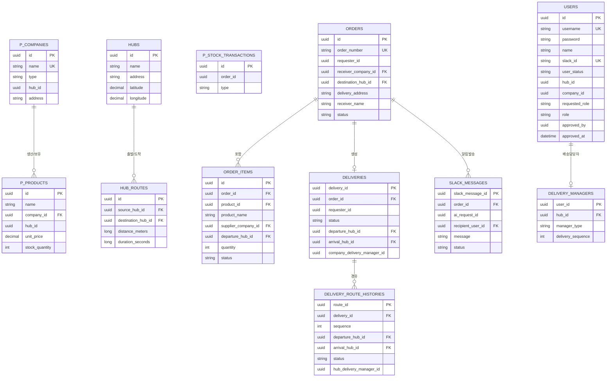

<div align="center">
  
# 🚛 logistics-service
### 물류 관리 및 배송 시스템을 위한 MSA 기반 플랫폼


<br>


</div>

---

## 🛠 기술스택

| 구분 | 기술 |
|---|---|
| Backend | Java 21, Spring Boot 4.0.7, Spring Security7,Spring Cloud 2025.1.2, Spring Data JPA |
| Database | PostgreSQL 17, Redis 7.4-alpine |
| AI | Gemini gemini-3.5-flash  |
| DevOps | Docker, Docker Compose, 추후 작성 |

<br>

## 🏗 시스템 아키텍처


<br><br>


## 서비스 구성
### Infrastructure
| 서비스 | 포트 | 역할 |
|---|---|---|
| Eureka Server | 8761 | 서비스 등록 및 디스커버리 |
| Config Server | 8888 | 서비스별 설정 중앙 관리 |
| API Gateway | 8080 | 요청 라우팅, JWT 인증·인가, 사용자 정보 헤더 전달 |


### Micro Service
| 서비스 | 포트 | 역할 | 담당자 |
|---|---|---|---|
| User | 8081 | 회원가입, 로그인, 사용자·권한·세션 관리 | 이강석 |
| Hub | 8082 | 허브 정보 및 허브 간 이동 경로 관리 | 안병규 |
| Company/Product | 8083 | 업체 및 상품 정보·재고 관리 | 권순혁 |
| Delivery | 8084 | 배송 정보 및 배송 담당자 관리 | 이재형 |
| Order | 8085 | 주문 생성·조회·취소 및 상품 재고 차감 요청 | 홍태규 |
| Notification | 8086 | Slack 알림 생성 및 발송 이력 관리 | 김서인 |

<br>

## 📂 프로젝트 구조
```
logistics-service/
├── libs/
│   └── common/                         # 공통 응답·오류·범용 유틸의 위치
├── infra/
│   ├── config-server/                  # 8888: 설정 제공
│   ├── eureka-server/                  # 8761: 서비스 등록·발견
│   ├── gateway/                        # 8080: 외부 요청 진입점
│   └── postgres/init/                  # 로컬 DB 스키마 초기화 SQL
├── apps/
│   ├── user-service/                   # 8081, users
│   ├── hub-service/                    # 8082, hubs
│   ├── company-product-service/        # 8083, company_products
│   ├── delivery-service/               # 8084, deliveries
│   ├── order-service/                  # 8085, orders
│   └── notification-service/           # 8086, notifications
├── config-repo/                        # Config Server가 제공하는 설정 원본
└── docker-compose.yml                  # 로컬 PostgreSQL 실행
```

<br>

## 💾 ERD



> **참고**: 각 서비스는 물리적으로 독립된 스키마(DB)를 사용하는 MSA 구조라, 위 관계는 실제 DB 외래키 제약이 아니라 서비스 간 API 호출로 연결되는 논리적 관계입니다.
<br>

## 🚀 실행 방법
### 요구사항
- Java 21 이상
- Docker & Docker Compose

### 1. 인프라 설정
```
docker-compose up -d
```
PostgreSQL, Redis가 실행됩니다.

### 2. 환경변수 설정
루트 디렉토리에 `.env` 파일을 생성하고 DB 계정 정보 등을 설정합니다. (`docker-compose.yml`의 `${DB_USERNAME:-logistics}` 형태 변수 참고)

### 3. 서비스 빌드
```bash
./gradlew build
```

### 4. 서비스 실행
아래 순서대로 실행해야 정상적으로 연결됩니다.
infra/config-server
infra/eureka-server
infra/gateway
apps/ 하위 각 마이크로서비스 (순서 무관)

### 5. URL
| 서비스 | URL |
|---|---|
| API Gateway | http://localhost:8080 |
| Swagger | http://localhost:8080/swagger-ui.html |
| Dev 서버(배포) | https://dev.nodyy.com |
<br>

## 📚 주요 기능
### 1. User
- 회원가입, 로그인, 로그아웃, 토큰 재발급
- JWT와 Redis를 활용한 인증 및 세션 관리
- 회원 가입 및 승인 시 Hub, Company 서비스 연동
- 사용자 정보 조회·수정 및 회원 탈퇴
- 관리자 회원 승인·거절 및 사용자 검색
- 배송 담당자 승인 시 Delivery 서비스 연동

### 2. Company & Product
- 업체 등록·조회·수정 및 삭제
- 업체별 상품 등록·조회·수정 및 삭제
- 상품 재고 관리
- 허브와 연계한 업체 소속 정보 관리

### 3. Hub
- 허브 등록·조회·수정 및 삭제
- 허브 간 이동 경로 관리
- 출발·도착 허브를 기반으로 배송 경로 제공

### 4. Order
- 주문 생성·조회·수정 및 취소
- 주문 상품 정보와 수량 관리
- 상품 서비스와 연동한 재고 차감 및 복구
- 주문 상태 및 처리 이력 관리
- 배송 및 알림 서비스 연동?

### 5. Notification
- 주문 및 배송 정보를 기반으로 알림 메시지 생성
- Slack을 통한 배송 알림 발송
- 알림 발송 상태와 발송 이력 관리
- Gemini gemini-3.5-flash를 활용한 알림 메시지 생성

### 6. Delivery
- 배송 생성·조회 및 상태 관리
- 허브 배송 및 업체 배송 담당자 관리
- 배송 담당자 순번 배정

<br>


## 🚨 트러블 슈팅
**1. 유니크 제약으로 인한 소프트 삭제 데이터 재사용 불가**
- 문제: `Company.name`에 일반 유니크 제약을 걸면, 삭제된 업체의 이름을 재사용할 수 없음
- 해결: PostgreSQL 파셜 유니크 인덱스(`WHERE deleted_at IS NULL`) 적용, `schema.sql` + `defer-datasource-initialization`으로 애플리케이션 레벨과 DB 레벨 검증 일치

**2. 재고 차감 멱등 처리 중 트랜잭션 롤백 오류**
- 문제: 동일 `orderId` 재요청 시 유니크 제약 위반을 `try-catch`로만 처리했더니, 트랜잭션이 "rollback-only"로 마킹되어 `UnexpectedRollbackException` 발생
- 해결: 선점 로직을 `REQUIRES_NEW`로 별도 트랜잭션 분리, `TransactionAspectSupport.setRollbackOnly()`로 명시적 롤백 처리하여 부모 트랜잭션과 격리

**3. 공용 모듈(libs/common) merge conflict로 인한 전체 서비스 빌드 실패**
- 문제: 여러 팀원의 PR이 동시에 `libs/common`을 수정하면서 merge conflict가 잘못 해결되어 `develop`의 컴파일 자체가 실패, 전체 팀의 CI가 막힘
- 해결: 신속하게 원인 파악 후 hotfix 브랜치로 즉시 수정 및 최우선 병합

**4. Windows/Mac 간 gradlew 줄바꿈 문제로 Docker 빌드 실패**
- 문제: Windows에서 체크아웃 시 `gradlew`가 CRLF로 저장되며 Alpine 기반 Docker 이미지에서 `exit code 127` 발생
- 해결: 줄바꿈을 LF로 수정, `.gitattributes`로 재발 방지

<br>
